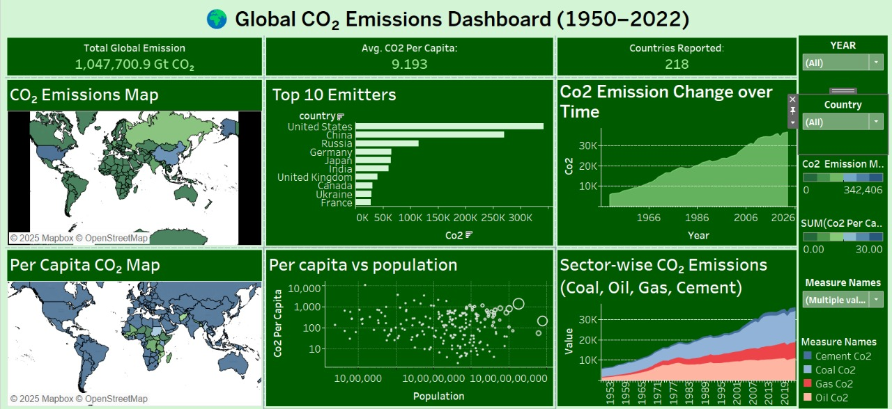
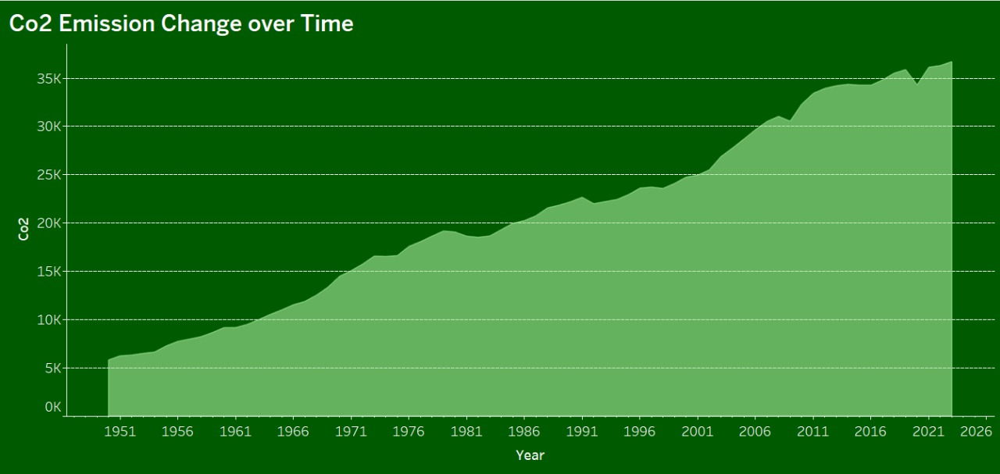
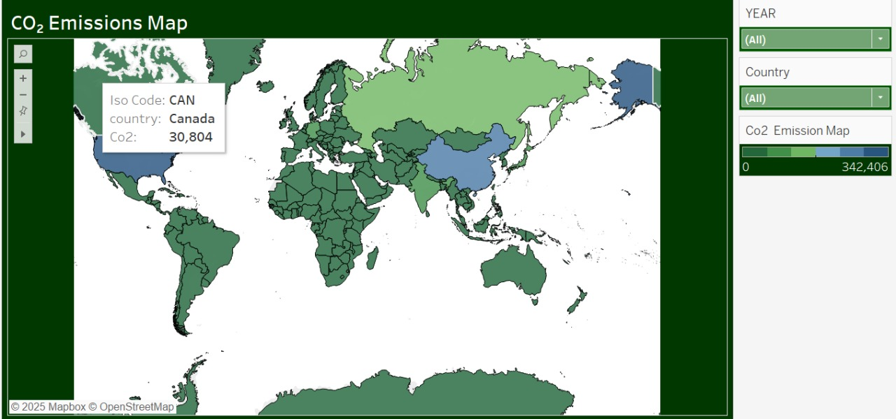
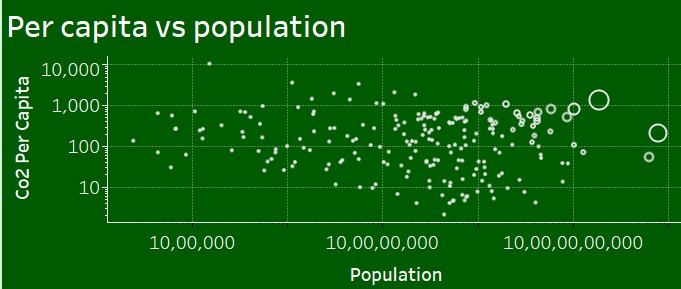

# 🌍 Global CO₂ Emissions & Climate Dashboard

This interactive Tableau dashboard visualizes global CO₂ emissions trends across time, countries, and sectors using data from [Our World in Data](https://ourworldindata.org/co2-emissions). It allows users to explore emissions patterns, population-adjusted impact, and sectoral contributions through intuitive visuals.

---

## 📊 Dashboard Features

- 📈 **Time Series Area Chart** of CO₂ emissions from 1950 to 2023
- 🗺️ **CO₂ Emission Map** by Country (total & per capita)
- 🧱 **Sector-wise Emissions Breakdown** (e.g., transport, industry)
- 📉 **Scatter Plot** comparing CO₂ with population or GDP
- 🧭 **Interactive Filters**: Country, Year, Emission Type
- 🎨 Color legends with tooltips for dynamic interpretation

---

## 📸 Dashboard Screenshots

### 🖼️ Full Dashboard View

### 📈 Area Chart – Global CO₂ Over Time

### 🗺️ CO₂ Emissions by Country (Map View)

### 🔍 Scatter Plot – CO₂ vs Population/Income

---

## 🗂️ Files Included

| File / Folder           | Description                             |
|-------------------------|-----------------------------------------|
| `Global_CO2_Dashboard.twbx` | Tableau packaged workbook             |
| `screenshots/`          | Visual snapshots of the dashboard       |
| `README.md`             | Project overview and instructions       |
| `Data`                  |  Dataset(Raw, Cleaned)                  |

---

## 📈 Dataset Source

- 📊 [Our World in Data – CO₂ Dataset (GitHub)](https://github.com/owid/co2-data)

## 🛠️ Tools Used

- **Tableau Desktop** – Dashboard creation
- **Excel & Python**  – For preprocessing
- **GitHub** – For version control and portfolio sharing

---

## 💡 Key Insights

- Global CO₂ emissions have steadily increased since 1950, peaking around 2019.
- China overtook the U.S. in 2006 as the top CO₂ emitter, with emissions rising from 5,882 MtCO₂ (2005) to 6,494 MtCO₂, while the U.S. dropped from 6,132 to 6,053 MtCO₂.
-  India's CO₂ emissions have shown a sharp and steady rise since the 1990s, crossing 3,000 MtCO₂ by 2022, driven by rapid industrialization, population growth, and energy demands.
-  Coal and oil have consistently dominated global CO₂ emissions, remaining the largest sectoral contributors across decades due to widespread use in power generation, transport, and industry.
- Visual tools help highlight which countries are improving vs worsening in emissions impact.
  

---

## 🚀 How to Use the Dashboard

1. Clone this repository or download the `.twbx` file.
2. Open it in Tableau Desktop or Tableau Public Desktop.
3. Use filters to interact with views and extract insights.

---

